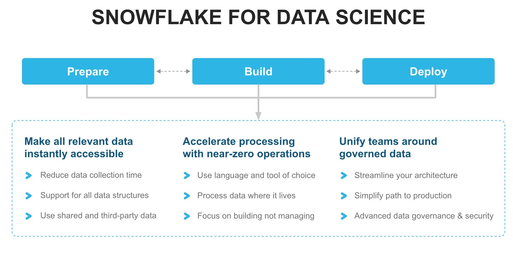
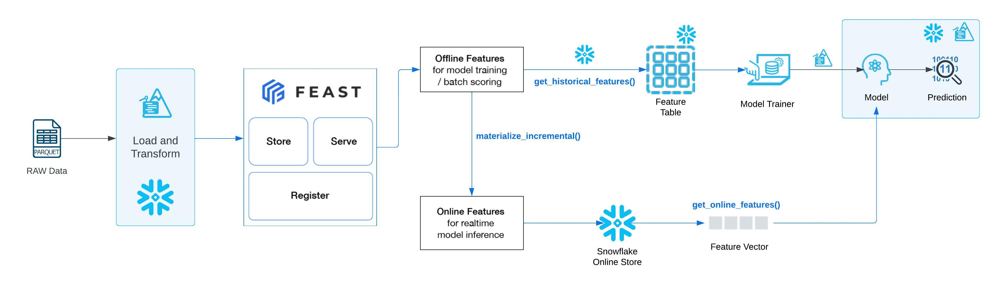

# Customer Churn analysis

## Snowpark Python for Data Science

<b>
As a data engineering and data science team member at a Telecom company, we have been tasked to build an end to end data pipeline and model in snowflake to support customer churn analysis by data science team. For this we have some customer data that our data science team would need.  We are responsible to build a feature store for the data science team. </b>

# Challenges
* As Data Engineers we want to build an end to end pipeline within snowflake and reduce the overall cost and technology footprints so that there are less point of failures
* On one hand we have customer billing and demographics data saved in semi structured format (PARQUET) and on other we have unstructured data in the form of emails
* We want to simplify the data pipeline by ingesting and processing the data closer within snowflake
But there are multiple developers persona in our team. Some know SQL, Some are Java and python professionals
* We also need to make data scientist’s life easier by cleaning, formatting, transforming and creating a feature store for them to refer in churn analysis
* We have selected Feast to build and deploy our feature store for offline store implementation.

# Feast Feature Store

We will deploy the Feast feature store and will configure 'feature views' for the features created in Snowflake and 'feature service' to deliver those features through offline feature store for model training purposes.

* In notebook ~01, we will use Snowpark for python to load raw data into snowflake and transform the data to create customer entities. 
* In notebook ~02, we will setup Feast, configure the integration with Snowflake, define and setup Feature repository, deploy and test the deployment.
* In notebook ~03, we will create training dataframe using Feast offline feature store, train the model, evaluate the model and deploy it on Snowflake as a UDf for batch inferencing.

# Machine Learning Pipeline

Run the notebooks starting from **01~** to **03**. we will go through the implementation of each one of the steps in the Machine Learning Pipeline. 

We will discuss:

1. **Data Preparation**
2. **Extracting training data from offline Feast feature store**
3. **Feature Engineering**
4. **Feature Selection**
5. **Model Training**
6. **Checking model predictions using Feast online feature store**
7. **Obtaining Predictions / Scoring**
